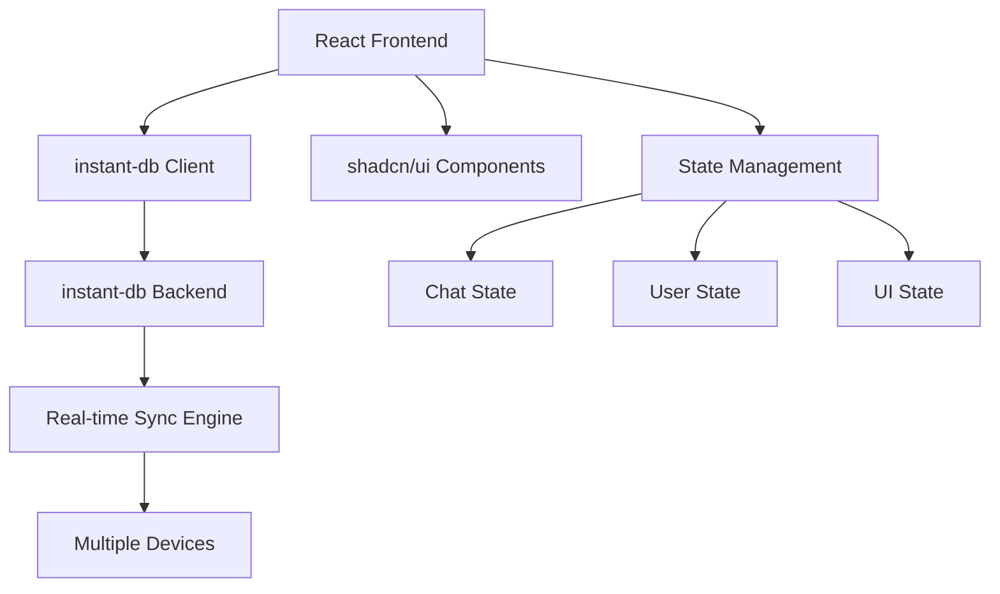

# Design Document

## Overview

The instant messaging application will be built as a React-based web application using instant-db for real-time data synchronization and shadcn/ui for the component library. The architecture follows a client-side approach where instant-db handles real-time data persistence, synchronization, and offline capabilities across devices.

The application will feature a single-page interface with three main areas: an alias entry screen for new users, the main chat interface with message display and input, and a sidebar showing online users. The design emphasizes simplicity and real-time responsiveness.

## Architecture

### High-Level Architecture



### Technology Stack

- **Frontend Framework**: React 18+ with TypeScript
- **UI Components**: shadcn/ui with Tailwind CSS
- **Real-time Database**: instant-db JavaScript library
- **State Management**: React Context + useReducer for local UI state
- **Build Tool**: Vite
- **Styling**: Tailwind CSS with shadcn/ui theming

### instant-db Integration

instant-db will handle:
- Real-time message synchronization across devices
- User presence and online status
- Message persistence and history
- Automatic conflict resolution
- Offline support with sync when reconnected

## Components and Interfaces

### Core Components

#### 1. App Component
- Root component managing global state and routing
- Handles instant-db initialization and connection status
- Manages user authentication state (alias-based)

#### 2. AliasEntry Component
- Form for users to enter their unique alias
- Real-time validation against existing aliases
- Uses shadcn/ui Form, Input, and Button components
- Integrates with instant-db to check alias uniqueness

#### 3. ChatInterface Component
- Main chat container with three sections:
  - MessageList: Scrollable message display area
  - MessageInput: Text input with send functionality
  - UsersList: Online users sidebar
- Responsive layout that adapts to mobile/desktop

#### 4. MessageList Component
- Virtualized scrolling for performance with large message histories
- Message bubbles with different styling for own vs others' messages
- Timestamp display and message status indicators
- Auto-scroll to bottom for new messages

#### 5. MessageBubble Component
- Individual message display with sender alias
- Different styling for sent vs received messages
- Status indicators (sending, delivered, failed)
- Timestamp formatting

#### 6. MessageInput Component
- Text input with send button
- Typing indicator broadcast
- Enter key to send, Shift+Enter for new line
- Character limit and input validation

#### 7. UsersList Component
- Real-time list of online users
- User count display
- Join/leave notifications

#### 8. TypingIndicator Component
- Shows when other users are typing
- Displays multiple typing users appropriately
- Auto-hide after inactivity

### Data Models

#### User Model
```typescript
interface User {
  id: string;
  alias: string;
  isOnline: boolean;
  lastSeen: Date;
  joinedAt: Date;
}
```

#### Message Model
```typescript
interface Message {
  id: string;
  content: string;
  senderId: string;
  senderAlias: string;
  timestamp: Date;
  status: 'sending' | 'delivered' | 'failed';
}
```

#### TypingStatus Model
```typescript
interface TypingStatus {
  userId: string;
  userAlias: string;
  isTyping: boolean;
  lastTypingTime: Date;
}
```

### instant-db Schema

```javascript
// instant-db schema definition
const schema = {
  users: {
    id: 'string',
    alias: 'string',
    isOnline: 'boolean',
    lastSeen: 'date',
    joinedAt: 'date'
  },
  messages: {
    id: 'string',
    content: 'string',
    senderId: 'string',
    senderAlias: 'string',
    timestamp: 'date',
    status: 'string'
  },
  typingStatus: {
    userId: 'string',
    userAlias: 'string',
    isTyping: 'boolean',
    lastTypingTime: 'date'
  }
};
```

## Data Flow

### Message Sending Flow
1. User types message in MessageInput
2. On send, message is optimistically added to local state
3. instant-db persists message with 'sending' status
4. Real-time sync distributes message to all connected clients
5. Message status updates to 'delivered' when confirmed
6. All clients receive and display the new message

### User Join Flow
1. User enters alias in AliasEntry component
2. Client queries instant-db to check alias uniqueness
3. If unique, user record is created and marked online
4. User is redirected to ChatInterface
5. Other clients receive real-time notification of new user
6. UsersList components update across all clients

### Typing Indicator Flow
1. User starts typing in MessageInput
2. Typing status is broadcast via instant-db
3. Other clients receive typing update
4. TypingIndicator components show active typers
5. Typing status auto-expires after 3 seconds of inactivity

## Error Handling

### Connection Errors
- Display connection status indicator
- Show offline mode when instant-db connection is lost
- Queue messages locally when offline
- Auto-retry connection with exponential backoff
- Sync queued messages when connection restored

### Alias Conflicts
- Real-time validation during alias entry
- Clear error messages for duplicate aliases
- Suggestions for alternative aliases
- Prevent form submission with invalid alias

### Message Failures
- Retry mechanism for failed message sends
- Visual indicators for message status
- Option to manually retry failed messages
- Graceful degradation when real-time features unavailable

### Input Validation
- Message length limits with character counter
- Sanitization of user input to prevent XSS
- Alias format validation (alphanumeric, length limits)
- Rate limiting for message sending

## Testing Strategy

### Unit Testing
- Component testing with React Testing Library
- Mock instant-db for isolated component tests
- Test user interactions and state changes
- Validate form inputs and error handling

### Integration Testing
- Test instant-db integration with real database
- Verify real-time synchronization between multiple clients
- Test offline/online scenarios
- Validate message ordering and consistency

### End-to-End Testing
- Multi-user chat scenarios with Playwright
- Cross-device testing simulation
- Network interruption and recovery testing
- Performance testing with large message histories

### Manual Testing
- User experience testing on different devices
- Accessibility testing with screen readers
- Performance testing with multiple concurrent users
- UI responsiveness across different screen sizes

## Performance Considerations

### Optimization Strategies
- Virtual scrolling for message lists to handle large histories
- Message pagination to limit initial load
- Debounced typing indicators to reduce network traffic
- Efficient re-rendering with React.memo and useMemo
- Lazy loading of older messages

### instant-db Optimization
- Proper indexing for message queries
- Efficient subscription patterns to minimize data transfer
- Connection pooling and management
- Cleanup of old typing status records

## Security Considerations

### Input Sanitization
- XSS prevention through proper escaping
- Message content validation and filtering
- Alias validation to prevent malicious usernames

### Data Privacy
- No persistent user data beyond session
- Automatic cleanup of inactive user records
- Message retention policies
- No personal information collection beyond aliases

## Accessibility

### WCAG Compliance
- Proper ARIA labels for all interactive elements
- Keyboard navigation support
- Screen reader compatibility
- High contrast mode support
- Focus management for dynamic content

### shadcn/ui Benefits
- Built-in accessibility features
- Consistent focus indicators
- Proper semantic HTML structure
- Keyboard shortcuts support